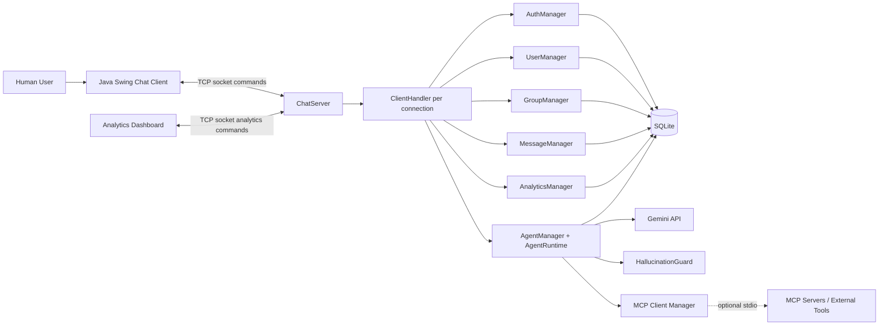
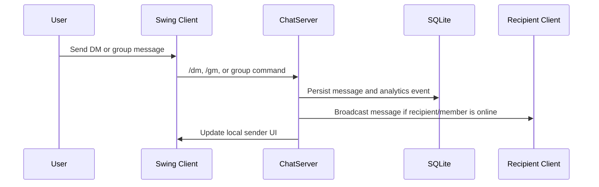
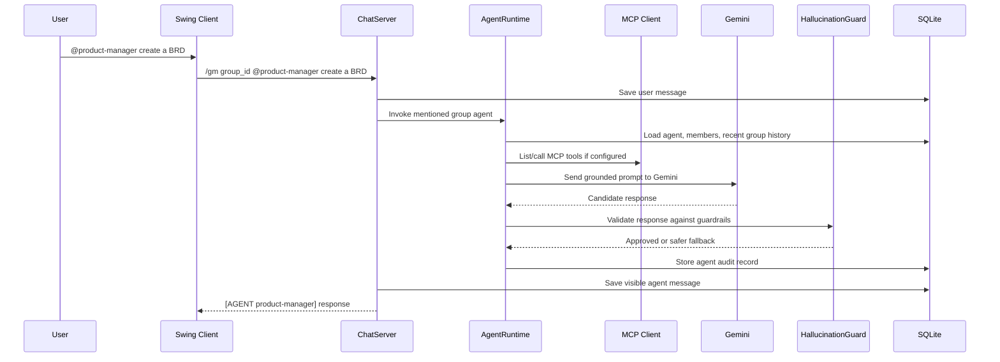

# AgentMesh

AgentMesh is a Java desktop chat platform with real-time direct messages, role-managed group chats, analytics, and Gemini-powered AI agents that can join group conversations as Product Manager and Program Manager teammates.

The app is built with Java Swing, TCP sockets, SQLite, Gemini API, and an MCP client boundary for tool-connected agent workflows.

## Highlights

- Real-time multi-user chat over Java sockets
- Direct messages with typeahead user search
- Group chats with owner controls for add, remove, promote, leave, and member inspection
- Built-in AI agents for group workspaces:
  - Product Manager
  - Program Manager
- `/agents` command for adding/removing AI agents from groups
- Gemini-backed agent responses using `GEMINI_API_KEY`
- MCP stdio client foundation for external tools and project context
- Hallucination controls that prevent agents from claiming unverifiable project facts
- SQLite persistence for users, contacts, messages, groups, analytics, agent membership, and agent audit logs
- Admin analytics dashboard for engagement and group-health reporting

## Screenshots

### Sign In


### Chat Workspace


### Active Conversation


### Group Chat


### Group Members


### Analytics Dashboard


## End-To-End Architecture



## Runtime Flow

### Human Chat Flow



### Agent Response Flow



## Agents

AgentMesh currently seeds two built-in agents on server startup.

| Agent | Mention | Purpose |
|-------|---------|---------|
| Product Manager | `@product-manager` | PRDs, BRDs, MVP scope, user stories, acceptance criteria, product tradeoffs |
| Program Manager | `@program-manager` | Milestones, launch plans, blocker tracking, owners, dependencies, risks |

### Add Agents To A Group

Open a group chat and type:

```text
/agents
```

The client opens an agent picker. Group owners can add or remove available agents.

### Ask An Agent

Use a group mention:

```text
@product-manager create a step-by-step BRD for building a marketplace website
@program-manager create a launch checklist for the beta release
```

Or use the explicit command:

```text
/ask_agent product-manager Draft MVP scope for this feature
```

## MCP Client Design

MCP support lives on the server side inside the agent runtime. The Swing client remains a human UI; the server acts as the agent host.

Current MCP implementation:

- `McpClientManager` defines the tool interface.
- `StdioMcpClientManager` can connect to a configured MCP stdio server.
- `NoopMcpClientManager` exists as a safe fallback.
- Agents list available MCP tools before answering.
- If no MCP tools are configured, agents avoid unverifiable claims about files, tickets, calendars, builds, task boards, or external project state.

Optional MCP environment configuration:

```bash
ECHO_MCP_SERVER_NAME=project-files
ECHO_MCP_STDIO_COMMAND=npx
ECHO_MCP_STDIO_ARGS="-y @modelcontextprotocol/server-filesystem ."
```

## Hallucination Handling

AgentMesh uses multiple layers to reduce hallucinated agent responses.

### Grounded Prompting

Every agent request includes:

- agent role instructions
- requesting user
- group id
- recent group history
- group members
- available MCP tools
- explicit instruction to avoid inventing files, tickets, owners, dates, research, metrics, or completion status

### Tool-First Policy

For project/external state, agents must rely on MCP tools. If tools are unavailable, the agent can still draft plans, PRDs, BRDs, and checklists, but it must not claim it inspected actual files, tickets, calendars, builds, or task systems.

### Hallucination Guard

`HallucinationGuard` checks responses before they are posted. It blocks risky claims such as:

- build or test status without evidence
- repository findings without an MCP tool result
- ticket/calendar/task-board facts without tool context
- completion claims without evidence

### Incomplete Response Guard

For BRD, PRD, roadmap, marketplace, and step-by-step requests, `AgentRuntime` checks whether Gemini returned only an intro or stopped mid-thought. If so, it retries once with an explicit completion instruction before posting the response.

### Audit Trail

Agent responses are stored in `agent_messages` with:

- group id
- agent id
- user prompt
- final agent response
- confidence
- timestamp

This makes agent behavior inspectable after the conversation.

## Project Structure

```text
AgentMesh/
├── src/
│   ├── App.java
│   ├── agent/
│   │   ├── Agent.java
│   │   ├── AgentMentionParser.java
│   │   ├── AgentResponse.java
│   │   ├── AgentRuntime.java
│   │   └── HallucinationGuard.java
│   ├── client/
│   │   ├── ChatClient.java
│   │   ├── ChatClientAuth.java
│   │   ├── ChatClientMessage.java
│   │   ├── ChatClientUI.java
│   │   ├── ChatClientUtils.java
│   │   ├── AnalyticsClient.java
│   │   ├── AnalyticsDashboardUI.java
│   │   └── Theme.java
│   ├── llm/
│   │   ├── Env.java
│   │   ├── GeminiClient.java
│   │   ├── LlmClient.java
│   │   └── LlmResponse.java
│   ├── mcp/
│   │   ├── McpClientManager.java
│   │   ├── McpToolCallResult.java
│   │   ├── McpToolDescriptor.java
│   │   ├── NoopMcpClientManager.java
│   │   └── StdioMcpClientManager.java
│   └── server/
│       ├── AgentManager.java
│       ├── AnalyticsManager.java
│       ├── AuthManager.java
│       ├── ChatServer.java
│       ├── ClientHandler.java
│       ├── Database.java
│       ├── GroupManager.java
│       ├── MessageManager.java
│       └── UserManager.java
├── img/
├── lib/
│   └── sqlite-jdbc-3.40.1.0.jar
├── scripts/
└── README.md
```

## Tech Stack

| Layer | Technology |
|-------|------------|
| Desktop UI | Java Swing |
| Networking | Java TCP sockets |
| Persistence | SQLite |
| JDBC Driver | `sqlite-jdbc-3.40.1.0.jar` |
| LLM | Gemini API |
| Agent tools | MCP stdio client boundary |
| Concurrency | Java threads |

## Setup

### 1. Configure Gemini

Create a local `.env` file in the project root:

```bash
GEMINI_API_KEY=your-gemini-api-key
ECHO_GEMINI_MODEL=gemini-2.5-flash
```

`.env` is ignored by Git.

### 2. Compile

```bash
javac -d bin -cp "lib/*" src/agent/*.java src/llm/*.java src/mcp/*.java src/server/*.java src/client/*.java src/App.java
```

### 3. Start Server

```bash
java -cp "bin:lib/*" App server
```

Custom port:

```bash
java -cp "bin:lib/*" App server 23456
```

### 4. Start Chat Client

Open another terminal:

```bash
java -cp "bin:lib/*" App client
```

Custom host/port:

```bash
java -cp "bin:lib/*" App client 127.0.0.1 23456
```

### 5. Start Analytics Dashboard

```bash
java -cp "bin:lib/*" App analytics
```

Custom host/port:

```bash
java -cp "bin:lib/*" App analytics 127.0.0.1 23456
```

## Chat Commands

| Command | Description |
|---------|-------------|
| `/agents` | Open the agent picker in the active group chat |
| `/ask_agent <agent_id> <message>` | Ask an added group agent directly |
| `/dm <user> <message>` | Send a direct message |
| `/add_dm <user>` | Add a direct-message contact |
| `/remove_dm <user>` | Remove a direct-message contact |
| `/group_create <name>` | Create a group |
| `/group_add <group_id> <username>` | Add a group member |
| `/group_remove <group_id> <username>` | Remove a group member |
| `/group_promote_owner <group_id> <username>` | Promote a member to owner |
| `/group_leave <group_id>` | Leave a group |
| `/group_members <group_id>` | List group members |

## Database Tables

Core tables:

- `users`
- `contacts`
- `messages`
- `groups`
- `group_members`

Agent tables:

- `agents`
- `group_agents`
- `agent_messages`
- `agent_tool_calls`

Analytics tables:

- `analytics_events`
- `analytics_timeseries`
- `analytics_daily_engagement`
- `analytics_daily_group_health`

## Security And Local Files

The repository intentionally ignores:

- `.env`
- `.env.*`
- `chat.db`
- `*.db`
- `bin/`
- compiled `*.class` files
- local planning notes in `local-plans/`
- local MCP context in `context/`

Do not commit API keys, generated databases, local context, or compiled artifacts.

## Current Limitations

- MCP support is implemented as a stdio client foundation. Tool-specific workflows still need to be configured per MCP server.
- The project currently uses raw `javac` commands. Moving to Maven or Gradle would make future SDK dependency management cleaner.
- Screenshots should be refreshed whenever the UI changes significantly.
